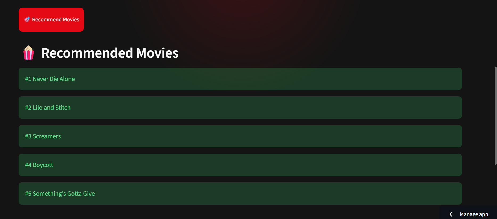

<u>Netflix Recommendation System</u>

A Netflix-inspired Movie Recommendation System built using Collaborative Filtering and Cosine Similarity. The application analyzes user-movie rating patterns and recommends movies that are similar to the one selected by the user.

The project demonstrates the complete Machine Learning workflow, including data preprocessing, similarity computation, recommendation generation, interactive web application development, and cloud deployment.

<u>Live Demo</u>

Streamlit App:
https://netflix-recommendation-system01.streamlit.app/

<u>Project Preview</u>
-Home Page

-Recommendation Results

-Cloud Deployment

<u>Project Overview</u>

Recommendation systems are one of the most widely used applications of Machine Learning in modern platforms such as Netflix, Amazon, Spotify, and YouTube.

This project implements a Collaborative Filtering Recommendation Engine that suggests movies based on user rating behavior.

Instead of relying on movie genres or descriptions, the system identifies patterns in user interactions and recommends movies that tend to be liked by similar users.

<u>Problem Statement</u>

Given historical movie ratings from users, recommend movies that are most similar to a selected movie.

The recommendation process should:

-Analyze user-movie interactions
-Compute similarity between movies
-Return the most relevant recommendations
-Provide an easy-to-use web interface

<u>Tech Stack></u>
Programming Language
-Python
Machine Learning
-Scikit-Learn

Used for:

1.Cosine Similarity computation
2.Similarity matrix generation
3.Recommendation ranking

<u>Data Processing</u>
Pandas

Used for:

1.Reading datasets
2.Data cleaning
3.Pivot table creation
4.Matrix manipulation

Web Application
-Streamlit

Used for:

1.Interactive user interface
2.Movie selection dropdown
3.Recommendation display
4.Cloud deployment

Features implemented:

-Responsive UI
-Custom CSS Styling
-Recommendation Cards
-Real-time Prediction
-Version Control

Git

Used for:

-Source code management
-Commit history tracking
-Project versioning

Common commands used:

git add .
git commit -m "message"
git push

Repository Hosting
GitHub

Used for:

-Code hosting
-Collaboration
-Project documentation
-Deployment integration

Repository:

https://github.com/Khushubansal29/Netflix-Recommendation-System
Cloud Deployment
Streamlit Community Cloud

Used for:

-Hosting the application online
-Public access through URL
-Automatic deployment from GitHub
Machine Learning Approach
Collaborative Filtering

Collaborative Filtering recommends movies by identifying patterns in user behavior.

Instead of analyzing movie content, the model learns from user ratings.

Example:

User A likes:
Movie X
Movie Y

User B likes:
Movie X
Movie Y
Movie Z

→ Recommend Movie Z to User A
User-Movie Matrix

The dataset is transformed into a matrix:

User	Movie 1	Movie 2	Movie 3
User A	5	4	0
User B	4	5	3
User C	0	2	5

Missing ratings are filled with:

fillna(0)
Cosine Similarity

Movie similarity is computed using:

cosine_similarity()

Formula:

Similarity(A,B)=
∣∣A∣∣∣∣B∣∣
A⋅B
	​

Movies with higher similarity scores are recommended.

<u>Project Structure</u>
Netflix-Recommendation-System/
│
├── app.py
│
├── data/
│   ├── sample_ratings.csv
│   └── raw/
│       └── movie_titles.csv
│
├── src/
│   ├── collaborative_filtering.py
│   ├── recommendation_engine.py
│   ├── movie_lookup.py
│   ├── eda.py
│   └── create_sample.py
│
├── reports/
│   ├── EDA_Report.md
│   └── rating_distribution.png
│
├── requirements.txt
│
└── README.md

<u>Recommendation Pipeline</u>
Netflix Dataset
        │
        ▼
Data Preprocessing
        │
        ▼
User-Movie Matrix
        │
        ▼
Cosine Similarity Matrix
        │
        ▼
Recommendation Engine
        │
        ▼
Streamlit Interface
        │
        ▼
User Recommendations

<u>Features</u>
-Collaborative Filtering based recommendations
-Cosine Similarity scoring
-Interactive Streamlit interface
-Netflix-inspired UI
-Cloud deployment
-End-to-end machine learning workflow
-GitHub integration

<u>Dataset</u>

The project uses a sampled subset of the Netflix Prize Dataset.

To ensure lightweight deployment and faster experimentation, a representative subset of movies and ratings was used instead of the complete dataset.

The recommendation engine can be extended to larger datasets with minimal code modifications.

<u>Key Learnings</u>

Through this project, I gained hands-on experience in:

-Recommendation Systems
-Collaborative Filtering
-Similarity Metrics
-Data Preprocessing
-Streamlit Development
-Git & GitHub Workflow
-Cloud Deployment
-End-to-End Machine Learning Projects

<u>Author</u>

Khushboo

B.Tech Chemical Engineering
Indian Institute of Technology Roorkee

GitHub:
https://github.com/Khushubansal29